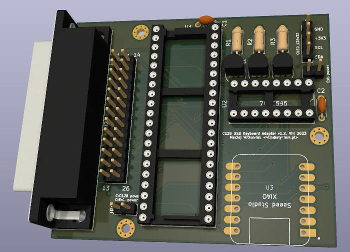

# C128 USB Keyboard

This project is designed to allow a modern USB keyboard to be used with a Commodore 128D/DCR in place of the original Commodore keyboard.

This was initially forked from https://github.com/Hartland/C64-Keyboard but I made lots of both hardware and software modifications
to achieve my goal of supporting full C128 keyboard.

I have kept only USB section as PS/2 keyboards are becoming retro themselves.

This project requires SEEED XIAO SAMD21, which has USB-C socket. USB-C keyboards are rare yet. I use OTG USB-A (female) to USB-C (male) adapter to connect standard PC keyboard.

-- Maciej 'YTM/Elysium' Witkowiak

# Features

- can be used with any USB keyboard, including wireless ones
- all C128 keys are mapped, including `40/80`, `CAPS`, second set of cursors
- four keyboard maps switchable on the fly
- NUMLOCK and SHIFT+NUMLOCK enable joystick mode on keypad, known from VICE (may not work with some games)
- for unmodified C128DCR external power can be provided separately
- OLED display support
- adapter can be plugged directly into keyboard port or mounted internally

# PCB and schematic

Use KiCad to open the project in [kicad-c128keyb](kicad-c128keyb/) folder.

In the [kicad-c128keyb/plots](kicad-c128keyb/plots) you will find ready to use Gerber files for manufacturing
as well as [schematic](kicad-c128keyb/plots/kicad-c128keyb.pdf)

The easiest way to order PCBs is through the shared project page on PCBWAY. Simply [click this link](https://www.pcbway.com/project/shareproject/C128_USB_Keyboard_adapter_dcf19251.html) and add to your cart.

## Parts

* SEEED XIAO SAMD21 (important: SAMD21, not RP2040)
* U1: MT8816 or MT8812
* U2: 74HCT595
* R1, R2, R3: 10K resistors
* Q1, Q2, Q3: 2N3904 transistors (or any other NPN, like S9013)
* C1, C2: 100n capacitors
* DB25 male socket for PCB (option 1)
* socket for 26-pin flat ribbon cable / 2x13 pin headers (option 2)
* pin headers and sockets
* 128x32 SSD1306 I2C OLED display (optional)

## Features

- can be plugged directly into keyboard port if male DB25 socket is soldered
- alternatively a flat ribbon cable can be used for both internal or external connection
- can be powered from keyboard port or from external source, selected by a jumper
- can be equipped with a 128x32 I2C OLED display for debug purposes

### Power (C128DCR only)

C128D has +5V power exposed on pin 4 of the keyboard port. C128DCR doesn't have this feature.
It's quite easy to make an internal modification in C128DCR and add that missing connection.

Here is one wire added to the bottom part of the C128DCR mainboard that connects +5V from joystick port to pin 4 of the keyboard port.

If you are unwilling to open your C128DCR, you can provide external power from nearby tape or joystick port instead.
In this case keep the jumper JP1 open and provide +5V to the `Ext. power` connector. Mind the polarity.

Options:

- JP1 open: power through `Ext. power` for unmodified C128DCR
- JP1 closed: don't connect anything to `Ext. power`; for C128D or modified C128DCR

### Flat cable: 26 pins (socket) to 25 pins (DB25 male)

If you don't want to keep the adapter sticking out of the side of computer you can make an extension cable.

You need:

* 26-wire flat ribbon cable
* 26-pin ribbon cable connectors (male for PCB, female for crimping on the cable)
* DE25 male crimp connector for ribbon cable

Steps:

1. Solder in 26 pin male ribbon cable connector to J1
2. Crimp 26 pin female ribbon cable connector to the cable, align red wire (first) with triangular mark
3. Separate 26th wire (last one, opposite to red) from the ribbon, cut it as close to the female connector as possible
4. Now the cable can be aligned and crimped in the DE25 connector; aligh red (first) wire with the mark on connector, confirm that it goes to pin 1

# Firmware

Use Arduino IDE to compile and flash sketch from [SEEED/C128_keyboard/C128_keyboard.ino](SEEED/C128_keyboard/C128_keyboard.ino).

* SEEED XIAO uses slightly modified USBHOST Arduino library [SEEED/C64_USB_Host_Library_SAMD](SEEED/C64_USB_Host_Library_SAMD). This directory will need to be copied into the Arduino library directory.

* SEEED XIAO will need its board driver installed into the Arduino IDE. See manufacturers instructions.

# Keyboard mapping

Key maps are defined in [SEEED/C128_keyboard/keymaps.h](SEEED/C128_keyboard/keymaps.h). You can modify existing ones or add your own.

If you add a new keymap you need to add it to `keymaps[]` array at the bottom of that file. The first key map in that array is the default one.

## C128 positional (default)

Top row has keys assigned in C128 fashion. This layout works best if you have muscle memory of the original keyboard.

| USB key | C128 key |
|---------|----------|
| ESC | RUN/STOP |
| F1 | ESC |
| F2 | TAB |
| F3 | ALT |
| F4 | CAPS/DIN (toggle) |
| F5 | HELP |
| F6 | LINEFEED |
| F7 | 40/80 (toggle) |
| F8 | NO SCROLL |
| F9 | F1/F2 |
| F10 | F3/F4 |
| F11 | F5/F6 |
| F12 | F7/F8 |
| Print Screen | reset MT8816 switchboard |
| Scroll Lock | Shift Lock |
| Pause | switch to next keymap |
| Insert | POUND |
| Home | CLR/HOME |
| Page Up | RESTORE |
| End | RUN/STOP |
| NumLock | enable/disable joystick #2 on keypad |
| Shift+NumLock | enable/disable joystick #1 on keypad |
| (keypad) | C128 keypad |
| left CTRL | C= key |
| left SHIFT | left SHIFT |
| left ALT | C128 top cursor down |
| left Win | C128 top cursor up |
| right CTRL | C128 top cursor right |
| right SHIFT | right SHIFT |
| AltGr | RESTORE |

## C128 symbolic

As you would expect from standard keycaps, e.g. SHIFT+2 is '@', not '"'.

Other changes:

- C128 top cursors available via SHIFT+cursor arrows
- both left and right CTRL mapped to CTRL
- both left and right Windows mapped to C= key
- left ALT is C128 ALT
- AltGr is RESTORE

## C64 positonal

Same as C128 positional, except that numpad keys are mapped to 1-0 keys above QWERTY row

## C64 symbolic

Same as C128 symbolic, except that numpad keys are mapped to 1-0 keys above QWERTY row

# Joystick mode

Joystick mode is toggled when you hit NumLock (with or without SHIFT). When NumLock LED is ON then joystick mode is enabled.

Note that it's not supposed to replace your regular joysticks - joystick #2 actions may be interpreted by some games as keypresses.
